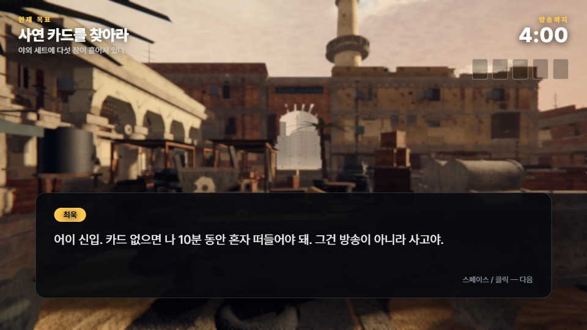
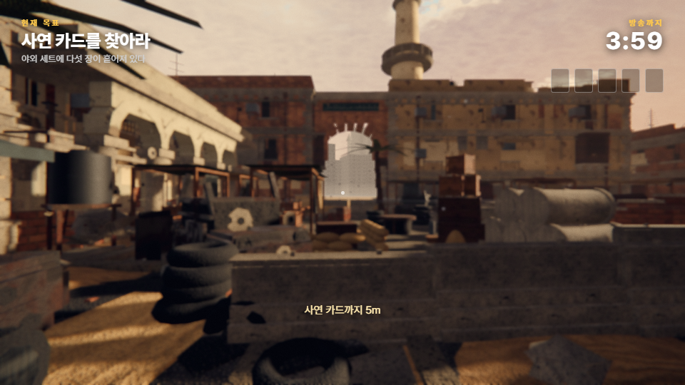
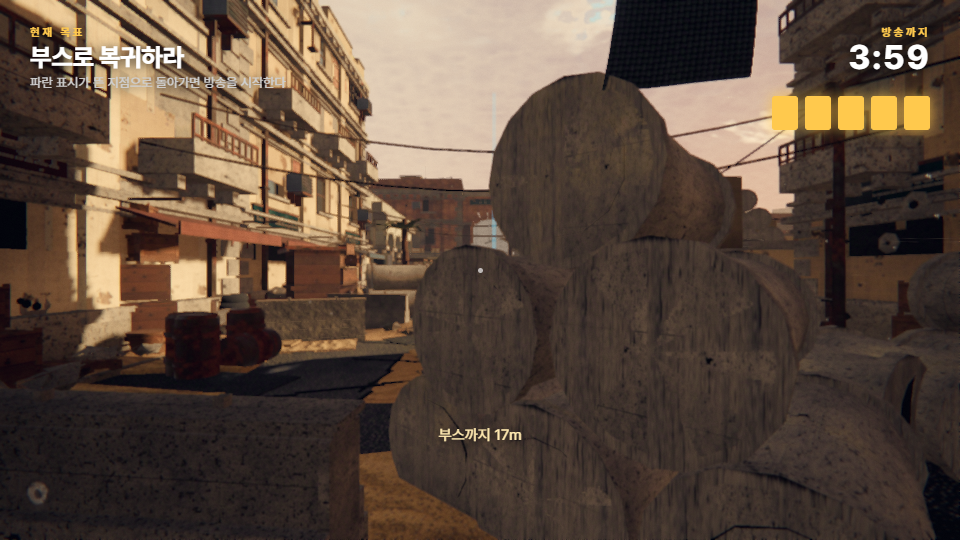

# 매불쇼 신입 작가 생존기

> 브라우저에서 바로 실행되는 **스토리형 FPS**.
> AI 에이전트 43개가 만든 3D 엔진([BLACKSITE](https://github.com/socialkim/blacksite-fps)) 위에
> 스토리 계층을 얹어 만든 팬메이드 패러디입니다.

## 🎮 지금 바로 플레이

**https://socialkim.github.io/maebulshow-game/**

설치도, 클론도, `npm install` 도 필요 없습니다. 링크를 열고 화면을 한 번 클릭하면 시작됩니다.



---

## 어떤 게임인가

오늘 첫 출근한 신입 작가가 되어, **매불쇼 서바이벌 특집 촬영장**에서 상대 팀을 뚫고
흩어진 **사연 카드 다섯 장**을 회수해 부스로 복귀하는 게임입니다.

- 카드를 주울 때마다 **대화 박스**가 뜨면서 게임이 잠시 멈춥니다 (튜토리얼 형식)
- 스페이스 또는 클릭으로 대사를 넘깁니다
- 모든 텍스트는 한글입니다
- 방송까지 남은 시간이 카운트다운되지만, **0이 되어도 게임은 끝나지 않습니다** (시연 중 하드 실패 방지)

### 조작

| 조작 | 키 |
|---|---|
| 이동 | `W` `A` `S` `D` |
| 둘러보기 | 마우스 |
| 달리기 | `Shift` |
| 앉기 | `Ctrl` 또는 `C` |
| 점프 | `Space` |
| 좌우 기울이기 | `Q` / `E` |
| 사격 | 마우스 좌클릭 |
| 조준 | 마우스 우클릭 유지 |
| 재장전 | `R` |
| 1인칭 / 3인칭 | `V` |
| 대사 넘기기 | `Space` 또는 클릭 |
| 마우스 해제 | `Esc` |

---

## ⚠️ 먼저 밝혀둡니다

- **이 게임은 팬메이드 패러디입니다.** 등장하는 모든 대사는 창작이며, 실제 인물의 발언이 아닙니다.
- **등장하는 상대 팀은 원본 엔진의 익명 가상 캐릭터입니다.** 실존 인물을 형상화하거나
  공격 대상으로 삼지 않습니다. 설정상 페인트탄을 쓰는 '서바이벌 특집 촬영'입니다.
- **시사·정치적 내용은 일절 포함되어 있지 않습니다.** 소재는 '생방송을 준비하는 스튜디오 현장'뿐입니다.

---

## 원본과 무엇이 다른가

원본 [BLACKSITE](https://github.com/socialkim/blacksite-fps)는 그대로 유지되며 계속 개선됩니다.
이 저장소는 그 엔진을 포크해 만든 **별도 버전**입니다.

| 항목 | 원본 BLACKSITE | 매불쇼 에디션 |
|---|---|---|
| 장르 | 1인칭 슈터 | 스토리형 1인칭 슈터 |
| 적 캐릭터 | 14명 | 10명 (`Config.ai.count = 10`) |
| 무기 | M4 카빈 뷰모델 | 동일 |
| 사격 | 마우스 좌클릭 | 동일 |
| HUD | 영문 캔버스 HUD | **한글 DOM HUD** (원본 HUD는 숨김) |
| 진행 | 자유 전투 | 대화 박스 · 수집 · 복귀 목표 |
| 언어 | 영어 | 한국어 |

렌더링·조명·레벨·이동은 원본을 그대로 씁니다. 즉 **그래픽 품질은 원본과 동일**합니다.

---

## 구현 구조

스토리 진행과 한글 HUD 는 전부 `src/story/Story.js` 한 파일에 모여 있습니다.
원본 모듈들은 거의 손대지 않았습니다 — 바꾼 것은 다음 세 곳뿐입니다.

```
src/core/Config.js     ai.count : 14 → 10       (상대 팀 수 조정)
src/main.js            Story 모듈을 마지막 단계로 추가
src/story/Story.js     신규 — 내러티브 레이어 + 한글 HUD 전체
```

`Story.js`가 하는 일:

1. **한글 HUD** — 목표 / 방송까지 남은 시간 / 카드 수집 / 탄약 / 제압 수 / 조준점
2. **전투는 원본 그대로** — 사격·적 AI·탄도 모두 BLACKSITE 엔진 그대로 동작한다
3. **수집품** — 월드에 사연 카드 5개 배치, 근접 2m 이내 자동 획득
4. **대화 시스템** — 화자 이름 + 타이핑 연출, 진행 중 플레이어 입력을 캡처 단계에서 동결
5. **진행 관리** — 인트로 → 수집 → 복귀 → 엔딩

플레이어 입력 동결은 이벤트 캡처 단계에서 `stopImmediatePropagation()` 으로 처리합니다.
포인터 락을 풀지 않기 때문에 대사를 넘기면 곧바로 조작이 이어집니다.

---

## 로컬에서 실행

```bash
npm install
npm run dev          # http://127.0.0.1:5173/
npm run build        # dist/ 에 정적 빌드
```

### 검증 하네스

```bash
node tools/check.mjs        # 모듈 파싱 검사
node tools/storycheck.mjs   # 부팅 → 인트로 → 카드 5장 → 엔딩까지 자동 플레이
```

`storycheck.mjs`는 헤드리스 브라우저로 실제 게임을 띄워 스토리 전 구간을 자동으로 밟아보고,
콘솔 에러가 하나라도 있으면 실패로 처리합니다. 마지막 실행 결과는 다음과 같습니다.

```
booted        : true
카드 회수     : 5 / 5
엔딩 도달     : true
콘솔 이슈     : 0
```

```bash
node tools/combatcheck.mjs   # 적 스폰 · 사격 · 탄약 HUD 동작 확인
```

```
적 스폰      : 10 | 무기 표시: true
탄약 HUD     : 30 / 210 → 24 / 210
사격         : mag 30 → 24 | 발사 수 6
콘솔 이슈    : 0
```

---

## 스크린샷

| | |
|---|---|
|  |  |

---

## 크레딧

- 엔진 — [BLACKSITE](https://github.com/socialkim/blacksite-fps) (AI 서브에이전트 43개가 생성)
- 3D — [three.js](https://threejs.org/) r180 · 외부 에셋 0개, 전부 절차적 생성
- 제작 — ITCL IT커뮤니케이션연구소 · 김덕진

팬메이드 헌정 프로젝트입니다. 상업적 목적이 없으며, 관련 권리자의 요청이 있으면 즉시 내리겠습니다.
